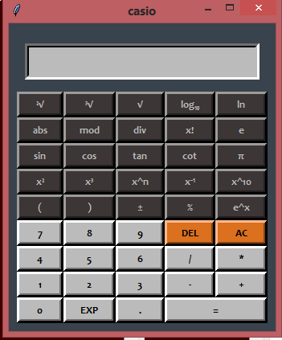

# Scientific Calculator

### Scientific calculator using Python's library Tkinter 

   

#### explanations for each button and the function which represents are the following : 
 

- **1st Row**

   

1. **2√** : Square root of a number  
2. **3√** : Cube root of a number  
3. **√**  : Any root of a number 
4. **log10** : The logarithm of a number with base 10 
5. **ln** : The logarithm of a number with base e 

 

- **2nd Row**

   

1. **abs** : The absolute value of a number 
2. **mod** : From *modulo*. it's the operation to find the remainder of the division of one number by another.   
3. **div** : Floor division returns the result of the division rounded down to the nearest integer.   
4. **x!**  : The factorial of the number x 
5. **e**   : The Euler's number. A mathematical constant approximately equal to 2.71828.   

- **3rd Row**

   

1. **sin** : Sine of an angle &theta; in degrees  
2. **cos** : Cosine of an angle &theta; in degrees  
3. **tan** : Tangent of an angle &theta; in degrees  
4. **cot** : Cotangent of an angle &theta; in degrees  
5. **π** : Archimedes' constant defined as the ratio of a circle's circumference to its diameter. 

- *4th Row*

   

1. **x2** : x raised to the power of 2 (e.g. 42 = 16). 
2. **x3** : x raised to the power of 3 (e.g. 53 = 125). 
3. **xn** : x raised to any power (e.g. 24 = 16 ). 
4. **x-1** : x raised to the power of (-1) 
5. **10x** : Powers of 10  

- *5th Row*

   

1. **(** : Left parenthesis.
2. **)** : Right parenthesis.
3. **±** : Change the sign of a number.
4. **%** : Find the percentage of a number
5. **ex** : Expotential function
